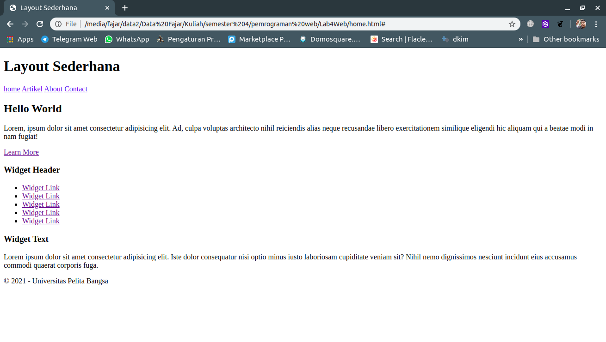
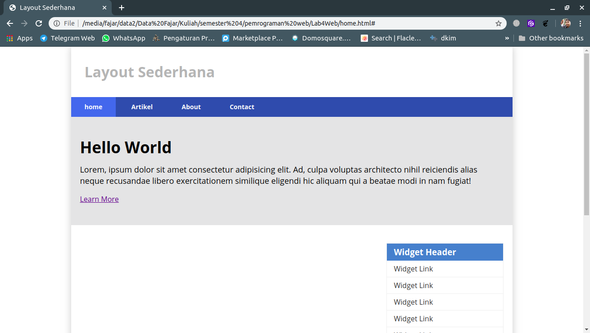
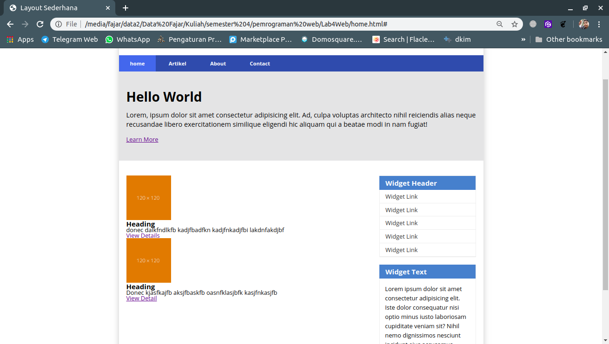
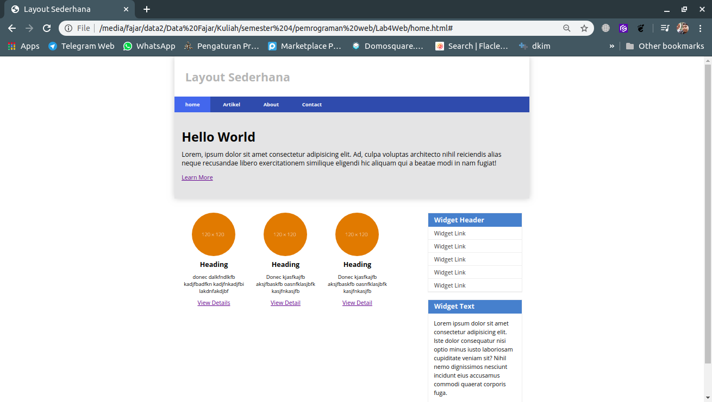
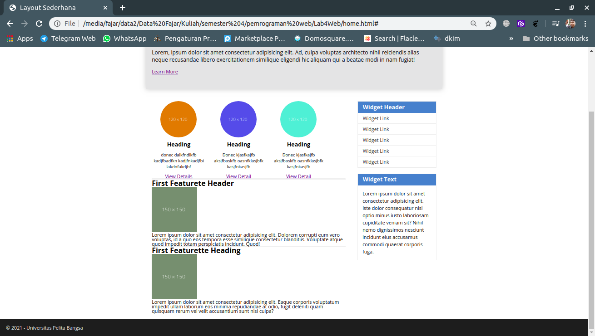
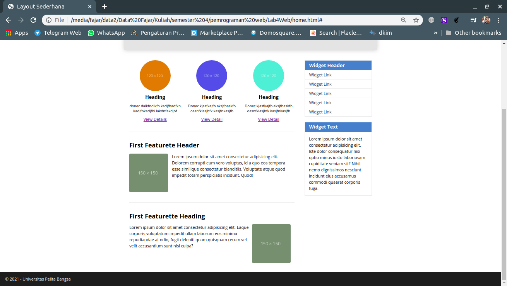
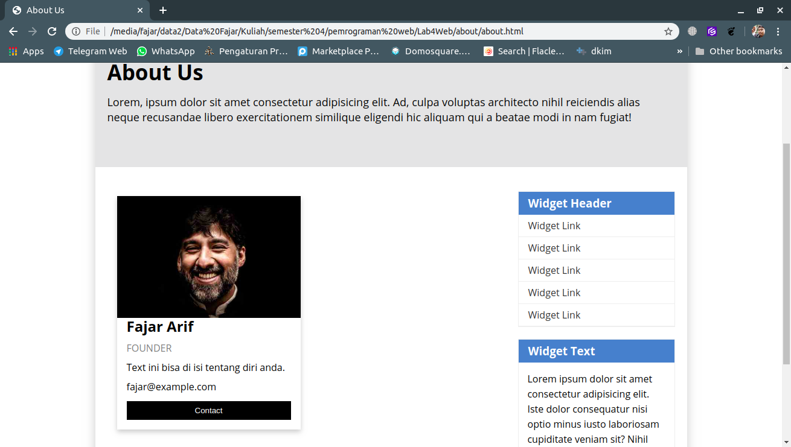
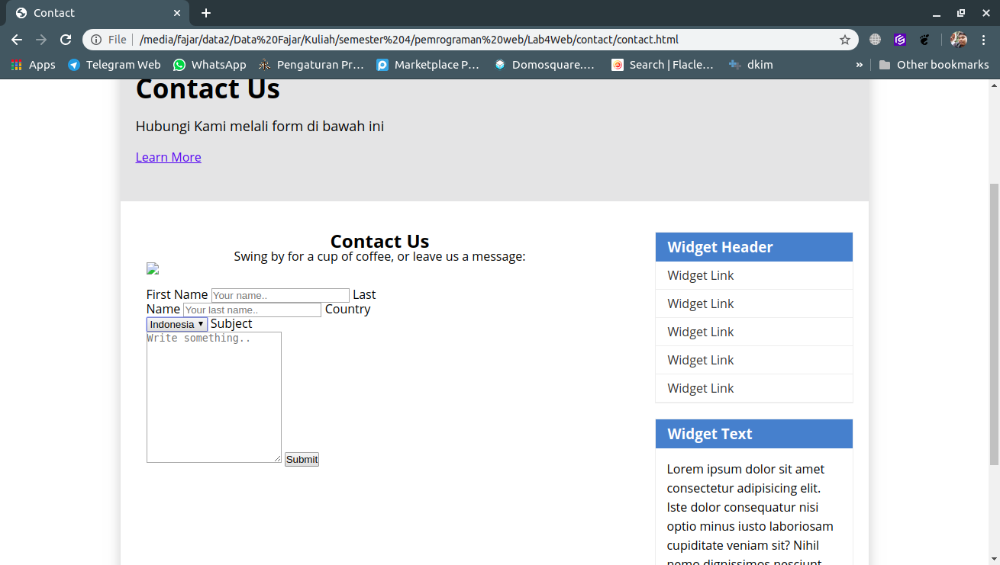
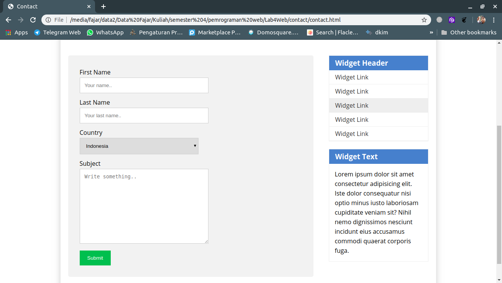

Fajar Arif Riyanto  
311910666  
TI 19 B2

1. Membuat dokumen HTML beserta konten yang akan dibuat   
     

2. Membuat css untuk layout tersbut
    

3. Menambah elemen pada main content  
    

4. Menambahkan css pada main content.
     

5. Menambahkan content lain pada main content.
    

6. Menambahkan style pada main content.
      

7. Membuat page About US dan menambahkan style css.  
      

8. Membuat Layout untuk page Contact.
    

9. Menambahkan style pada page Contact.
    

